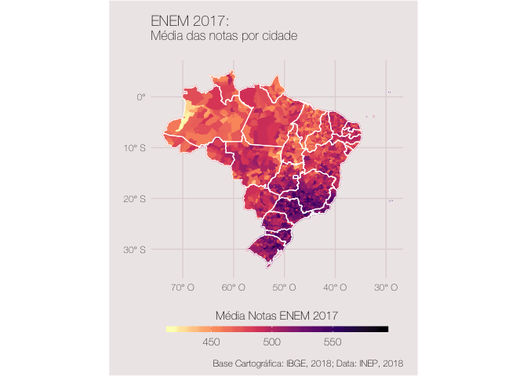
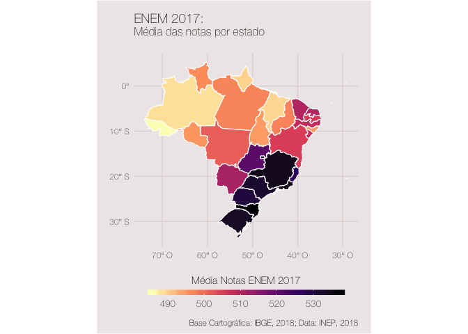

ENEM 2017 - SparklyR/Mapas
================

Um exemplo de aplicação do R + spark na manipulação de microdados.

Requisitos
----------

Inicialmente é necessária a instalação do Apache Spark e a biblioteca sparklyr. A instalação do framework pode ser facilmente realizada a partir deste ["tutorial"](http://spark.rstudio.com). Além do spark deve-se obter o shapefiles da região administrativas do brasil disponíveis [aqui](https://www.ibge.gov.br/geociencias-novoportal/cartas-e-mapas/bases-cartograficas-continuas/15759-brasil.html?=&t=downloads) e também neste repositório.

Download dos microdados do ENEM 2017
------------------------------------

Para a realização do download dos microdados é necessário "rodar" o arquivo file\_download.R. A pasta baixada contém diversos aquivos entre eles a pasta Dados com os microdados em formato csv (~4Gb). Outro arquivo importante é a biblioteca com informações sobre a planilha dos microdados.

Arquivos e análise
------------------

Após as estapas anteriores, criei dois scripts, um para este readme (ggplot) e outro para gerar mapas interativos (leaflet). Ambos o arquivos realizam a mesma manipulação dos dados (são retirados os participantes treineiros, somadas as notas de cada matéria e calculada a média das notas por cidade e estado)

Cidades
-------

Para visualizar a versão interativa do gráfico acima faça o download do arquivo [mapa\_enem\_cidade.html](https://github.com/JaildoR/ENEM-2017-Sparklyr-e-mapas/blob/master/mapa_enem_cidade.html) e em seguida abra no browser. Vale notar que, além das médias, esta versão também contém o número de provas analisadas. Além disso, o zoom permite uma melhor visualização dos dados como algumas particulares (ex. Cocal do Alves - PI, maior nota do nordeste, ou Paial - SC, maior média nacional - apenas um participante na cidade).

Estados
-------

No caso dos estados, a versão interativa pouco difere da estática. Para visualizar a versão interativa do gráfico acima faça o download do arquivo [mapa\_enem\_estado.html](https://github.com/JaildoR/ENEM-2017-Sparklyr-e-mapas/blob/master/mapa_enem_estado.html) e em seguida abra o arquivo no browser. Em um futuro próximo espero realizar uma análise mais ampla...
